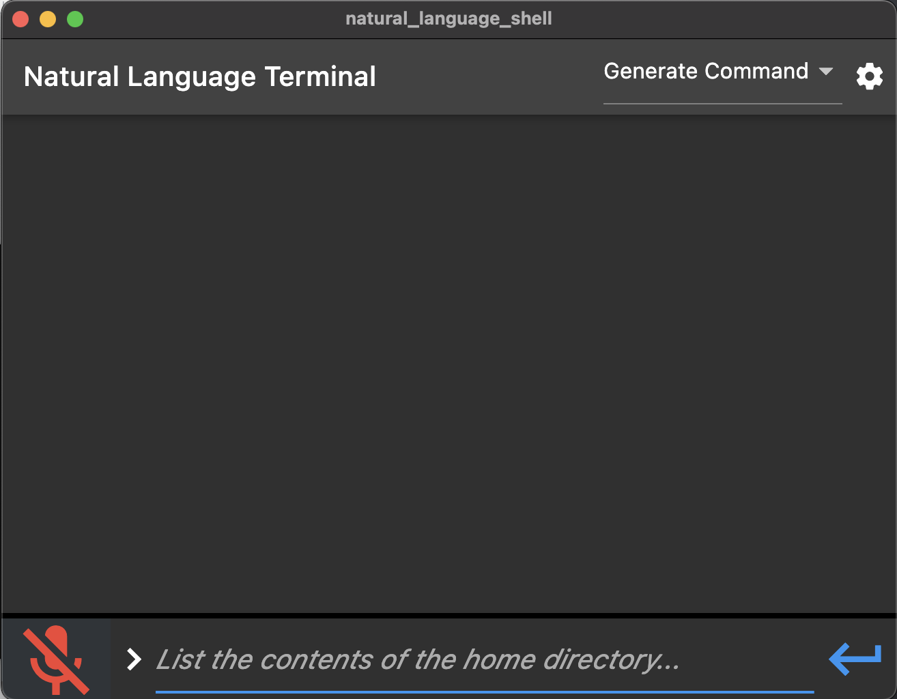

# Natural Language Shell

## Project Overview
This project is a terminal that is controlled with natural language. It supports both keyboard and voice input. Bash commands are generated by an OpenAI model and are executed locally after validation.

## Core Components

### Frontend
* The Frontend is built using Flutter.
* Users enter the desired requirements of their bash command and submit it--either with the enter key or the application's enter button.
* This is displayed as dialogue on the terminal and a response is generated below from the given prompt.

### Backend

#### OpenAI API Requests
* The natural language shell relies on OpenAI's [Davinci model](https://platform.openai.com/docs/models/davinci) to convert natural language into shell commands.
* After validating with the user that the command output meets their requirements, the command is routed to the shell execution section of the backend.

#### C++ Shell Command Execution
* This component of the backend is responsible for executing the bash commands generated by the OpenAI model.

## Project Challenges
* Flutter uses a foreign function interface to interact with the C++ backend. Setting this up with the necesssary C++ libraries took a bit of time.

## Demo Commands
Run these commands in the terminal to get their equivalent bash form.

### Natural Language Prompts
* List the contents of the home directory
* Find any files or folders related to ssl
* Show the permissions of the files in the current directory
* Generate a random password

### Generated Bash Commands and Sample Outputs
* `ls ~`
    * `android-sdk-linux`
    * `flutter`
* `find / -name "*ssl*"`
    * `/usr/share/perl-openssl-defaults/perl-openssl.make`
    * `/usr/bin/rsync-ssl`
    * `/usr/bin/dh_perl_openssl`
    * `/usr/bin/openssl`
    * `/var/lib/dpkg/info/libssl3:amd64.symbols`
* `ls -l`
    * `-rw-r--r-- 1 vscode vscode       643 Feb  5 11:08 Installation.txt`
    * `-rwxrwxrwx 1 root   root           0 Feb  4 17:41 README.md`
    * `-rw-r--r-- 1 vscode vscode 106521876 Feb  4 22:01 httplib.h.gch`
    * `-rw-r--r-- 1 vscode vscode    907858 Feb  5 12:03 json.hpp`
* `tr -dc A-Za-z0-9 < /dev/urandom | head -c 16`
  * `rX4Bs1u6MvJQdXg1`

## To get project running:
* Clone repo
* "cd natural-language-shell/frontend/natural_language_shell/cppCode/"
* run "cmake ." and "make" for each sub directory
* currently whisper integration only works on mac and linux

## Future Improvements
* When developing this project we experimented with a variety of OpenAI's models. It would be interesting to compare the performance of these models on similar tasks.
* To improve overall model performance, we could generate training data for bash commands and their natural language description. This would be used with OpenAI's [Fine-Tuning](https://platform.openai.com/docs/guides/fine-tuning/fine-tuning-beta) feature to concentrate our model on shell command generation.
* Allowing for more flexibility with the commands given to the shell (i.e. asking for an explanation of what a provided command does).
